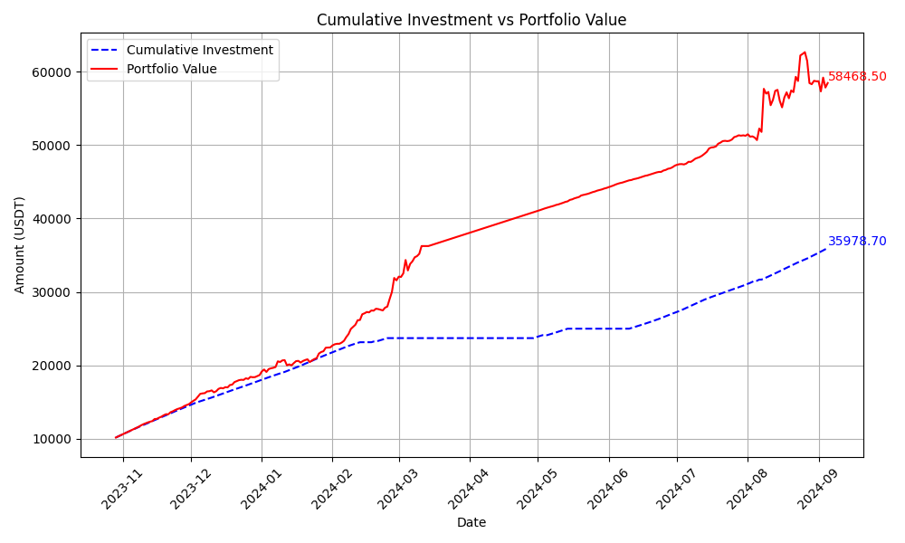

# ActiveDCA 策略

**ActiveDCA** 是一個基於比特幣價格波動和市場指標的動態成本平均策略。該策略會根據市場狀況動態調整投資額度，讓使用者在市場低估時增加持倉，在市場高估時退出市場。

[點選這裡檢視英文版](README.md)

## 目錄

- [ActiveDCA 策略](#activedca-策略)
  - [目錄](#目錄)
  - [簡介](#簡介)
  - [功能](#功能)
  - [安裝](#安裝)
  - [使用方法](#使用方法)
    - [基本使用](#基本使用)
    - [引數](#引數)
    - [回測](#回測)
  - [策略詳情](#策略詳情)
    - [範例場景](#範例場景)
  - [回測結果](#回測結果)
    - [1. 比特幣價格與買賣訊號](#1-比特幣價格與買賣訊號)
    - [2. 現金與比特幣持倉變化](#2-現金與比特幣持倉變化)
    - [3. 累計投資與投資組合價值](#3-累計投資與投資組合價值)

## 簡介

**ActiveDCA** 策略實現了一種專門為比特幣設計的動態成本平均法。不同於傳統的美元成本平均法（DCA），ActiveDCA 根據 **ahr999** 指標每日動態調整投資金額，該指標反映了比特幣的當前市場狀況與歷史趨勢的比較。

Ahr999 指標是比特幣社群內廣泛使用的度量工具，透過比特幣的當前價格、長期增長趨勢以及 200 日移動平均值的結合，來判斷比特幣市場的高估或低估。該策略可以根據市場情況進行靈活調整：當市場下跌時增加投資，當市場可能高估時減少投資甚至全數賣出持倉。

在 ahr999 值較低（市場可能被低估）的時期，ActiveDCA 會增加投資金額；而當 ahr999 顯示市場過熱時，該策略則減少投資，甚至賣出持倉以實現收益。這種靈活的方法能幫助投資者充分利用比特幣市場的波動，同時在中立或風險較高的時期保持現金儲備。

透過根據 ahr999 指標動態調整每日投資，ActiveDCA 為長期比特幣投資提供了一種比傳統固定投資額更為智慧和適應性更強的方式。

## 功能

- **動態投資**：根據市場狀況調整每日投資金額。
- **抄底買入**：利用可用現金在市場出現大幅下跌時進行更大額度的買入操作。
- **退出策略**：當市場高估時，自動賣出所有比特幣持倉。
- **現金累積**：當市場處於中立狀態時，暫停投資並累積現金，為未來的機會做準備。
- **再投資**：當市場再次下跌時，重新投資每日投資額和累積現金。

## 安裝

按以下步驟安裝並執行此專案：

1. 拉取此倉庫：

   ```bash
   git clone https://github.com/yourusername/ActiveDCA.git
   ```

2) 安裝所需的依賴：

   ```bash
   pip install -r requirements.txt
   ```

   本專案依賴於 `requests` 來獲取實時和歷史的價格資料。

3) 確保您的網路連線正常，以從外部 API 獲取比特幣價格資料。

## 使用方法

### 基本使用

你可以使用自己的引數初始化 **ActiveDCA** 類，並執行策略。以下是範例：

```python
from active_dca import ActiveDCA

# 使用 $10,000 初始現金初始化策略
strategy = ActiveDCA(cash=10000)

# 執行策略，根據當前市場狀況做出決策
action, amount = strategy.executeStrategy()
print(f"動作: {action}, 金額: {amount}")
```

### 引數

初始化策略時，可以調整以下引數：

- `cash`：初始現金額度。
- `stop_investing`：當 ahr999 低於此閾值時，繼續買入比特幣。
- `sell_threshold`：當 ahr999 高於此閾值時，賣出所有比特幣持倉。
- `dip_buy_threshold`：當 ahr999 低於此閾值時，進行抄底操作。
- `invest_percentage`：抄底時使用的現金百分比。
- `daily_investment`：在正常情況下每日投資的金額。
- `weight_coefficient`：根據市場狀況調整每日投資金額的系數。

### 回測

你可以使用歷史資料進行 **ActiveDCA** 策略的回測。回測類 `Backtest` 負責處理此過程，並生成回測效能圖表：

```python
import pandas as pd
from backtest import Backtest
from active_dca import ActiveDCA

# 載入歷史資料
df = pd.read_csv('historical_data.csv')

# 初始化策略
strategy = ActiveDCA(cash=10000)

# 初始化並執行回測
backtest = Backtest(strategy)
backtest.run_backtest(df)

# 儲存結果
backtest.save_results('backtest_results.csv')

# 生成圖表
backtest.generate_charts(df)
```

## 策略詳情

**ActiveDCA** 策略結合了以下幾個關鍵機制：

1. **動態投資**：根據當前 ahr999 （由比特幣價格波動和 200 日移動平均計算）決定每日投資金額。當 ahr999 較低時，策略加大投資，當 ahr999 較高時，策略暫停或賣出。

2. **抄底買入**：當市場跌至一定閾值以下時，策略利用可用現金進行抄底買入操作。

3. **退出策略**：當 ahr999 顯示市場高估時，策略會賣出所有比特幣持倉，在市場修正之前鎖定收益。

4. **再投資**：當市場條件改善（DCA 下降到閾值以下）時，策略會重新投資累積現金和每日投資金額。

### 範例場景

- **買入**：如果 ahr999 跌至 `stop_investing` 閾值以下，策略會增加每日投資金額。
- **賣出**：如果 ahr999 上升至 `sell_threshold`，策略會賣出所有比特幣持倉。
- **抄底**：如果市場出現突然下跌（ahr999 低於 `dip_buy_threshold`），策略會使用部分現金進行抄底。

## 回測結果

### 1. 比特幣價格與買賣訊號
此圖表顯示了比特幣價格與基於 AHR999 指標的買賣訊號。該策略使用不同的閾值來決定何時買入或賣出比特幣。


### 2. 現金與比特幣持倉變化
此圖表展示了現金與比特幣持倉隨著策略執行的變化。策略根據市場狀況，累積現金和比特幣。


### 3. 累計投資與投資組合價值
此圖表比較了策略的累計投資與投資組合價值，顯示了隨著時間推移，投資組合價值的增長情況及策略的表現。

