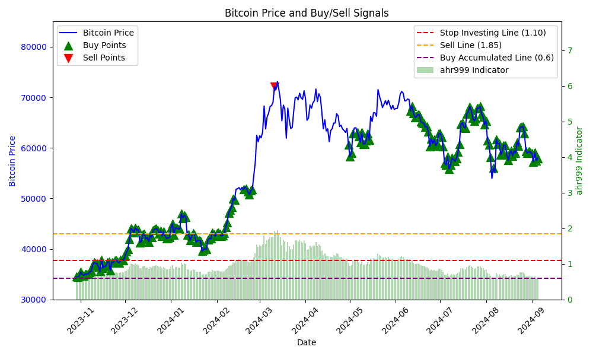
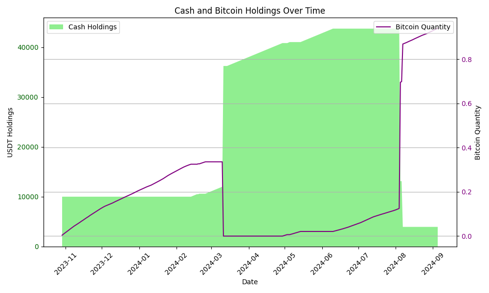
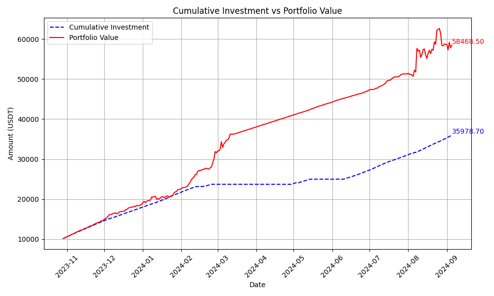

# ActiveDCA Strategy

**ActiveDCA** is a Python strategy class for executing dynamic cost averaging based on Bitcoin price movements and market indicators. It dynamically adjusts investments according to market conditions, allowing users to increase their exposure during undervalued market conditions and exit during overvalued situations.

[點選這裡檢視中文版](README-ZH.md)

## Table of Contents

- [ActiveDCA Strategy](#activedca-strategy)
  - [Table of Contents](#table-of-contents)
  - [Introduction](#introduction)
  - [Features](#features)
  - [Installation](#installation)
  - [Usage](#usage)
    - [Basic Usage](#basic-usage)
    - [Parameters](#parameters)
    - [Backtesting](#backtesting)
  - [Details of the Strategy](#details-of-the-strategy)
    - [Example Scenarios](#example-scenarios)
  - [Backtest Results](#backtest-results)
    - [1. Bitcoin Price and Buy/Sell Signals](#1-bitcoin-price-and-buysell-signals)
    - [2. Cash and Bitcoin Holdings Over Time](#2-cash-and-bitcoin-holdings-over-time)
    - [3. Cumulative Investment vs Portfolio Value](#3-cumulative-investment-vs-portfolio-value)

## Introduction

The **ActiveDCA** strategy implements a dynamic cost averaging method specifically designed for Bitcoin investments. Unlike traditional dollar-cost averaging (DCA) strategies that allocate a fixed amount periodically, ActiveDCA intelligently adjusts the investment amount daily based on the **ahr999** indicator, which reflects Bitcoin's current market state compared to historical trends.

The ahr999 indicator, a widely recognized metric in the Bitcoin community, evaluates Bitcoin's price relative to its long-term growth and its 200-day moving average. This allows the strategy to react dynamically to market conditions—allocating more capital during market dips and reducing exposure during potential overvalued periods.

ActiveDCA leverages this dynamic approach to minimize risk and maximize returns. During low ahr999 periods (indicating a potential undervaluation), the strategy increases its investment allocation. When the ahr999 value suggests that the market is overvalued, the strategy reduces investments or sells the entire position to lock in gains. This flexible approach helps investors capitalize on Bitcoin's volatility while preserving cash during neutral or high-risk periods.

By adjusting the daily investment based on the ahr999 indicator, ActiveDCA offers a more intelligent and adaptable approach to long-term Bitcoin investment, compared to traditional fixed-amount strategies.

## Features

- **Dynamic Investments**: Adjust the daily investment amount based on market conditions.
- **Dip Buying**: Utilize available cash for larger purchases during significant market dips.
- **Exit Strategy**: Automatically sell all Bitcoin holdings when the market becomes overvalued.
- **Cash Accumulation**: Pause investments when the market is neutral and accumulate cash for future opportunities.
- **Reinvestment**: When the market dips again, reinvest both the daily amount and accumulated cash.

## Installation

To install and run this project, follow these steps:

1. Clone the repository:

   ```bash
   git clone https://github.com/yourusername/ActiveDCA.git
   ```

2. Install required dependencies:

   ```bash
   pip install -r requirements.txt
   ```

   The project depends on `requests` for fetching real-time and historical price data.

3. Ensure you have a working internet connection to retrieve Bitcoin price data from external APIs.

## Usage

### Basic Usage

You can initialize the **ActiveDCA** class with your own parameters and run the strategy. Here's an example:

```python
from active_dca import ActiveDCA

# Initialize the strategy with a starting cash of $10,000
strategy = ActiveDCA(cash=10000)

# Execute the strategy to make decisions based on current market conditions
action, amount = strategy.executeStrategy()
print(f"Action: {action}, Amount: {amount}")
```

### Parameters

The following parameters can be adjusted when initializing the strategy:

- `cash`: The starting cash amount.
- `stop_investing`: The threshold under which the strategy will continue buying Bitcoin.
- `sell_threshold`: The threshold above which the strategy will sell all Bitcoin holdings.
- `dip_buy_threshold`: The threshold under which the strategy will perform a dip-buy.
- `invest_percentage`: The percentage of cash to be used for dip-buying.
- `daily_investment`: The amount to invest daily during normal conditions.
- `weight_coefficient`: Adjusts the daily investment amount based on market conditions.

### Backtesting

You can backtest the **ActiveDCA** strategy using historical data to simulate past performance. The `Backtest` class handles this process and generates performance charts:

```python
import pandas as pd
from backtest import Backtest
from active_dca import ActiveDCA

# Load historical data
df = pd.read_csv('historical_data.csv')

# Initialize the strategy
strategy = ActiveDCA(cash=10000)

# Initialize and run the backtest
backtest = Backtest(strategy)
backtest.run_backtest(df)

# Save results
backtest.save_results('backtest_results.csv')

# Generate charts
backtest.generate_charts(df)
```

## Details of the Strategy

The **ActiveDCA** strategy combines several key mechanisms:

1. **Dynamic Investment**: The strategy calculates how much to invest each day based on the current ahr999 value (calculated from Bitcoin price movements and its 200-day moving average). When the ahr999 value is low, the strategy increases its investment, and when the ahr999 value is high, it holds or sells.

2. **Dip Buying**: When the market dips below a certain threshold, the strategy takes advantage of the situation by investing a portion of the available cash.

3. **Exit Strategy**: When the ahr999 value indicates that the market is overvalued, the strategy exits by selling all Bitcoin holdings, locking in profits before a potential correction.

4. **Reinvestment**: When market conditions improve (DCA falls below a threshold), the strategy reinvests the accumulated cash and the regular daily investment.

### Example Scenarios

- **Buy**: If the ahr999 value drops below the `stop_investing` threshold, the strategy increases its daily investment.
- **Sell**: If the ahr999 value rises above the `sell_threshold`, the strategy sells all Bitcoin holdings.
- **Dip Buy**: If the market experiences a sudden dip (ahr999 value drops below `dip_buy_threshold`), the strategy performs a dip-buy using a percentage of the available cash.

## Backtest Results

### 1. Bitcoin Price and Buy/Sell Signals

This chart illustrates the Bitcoin price along with the buy/sell signals based on the AHR999 indicator. The strategy uses different thresholds to determine when to buy or sell Bitcoin.



### 2. Cash and Bitcoin Holdings Over Time

This chart shows the evolution of cash and Bitcoin holdings over time. As the strategy executes, it accumulates both cash and Bitcoin based on market conditions.



### 3. Cumulative Investment vs Portfolio Value

This chart compares the cumulative investment made by the strategy with the portfolio value, showing how the value of the portfolio grows over time and reflects the strategy's performance.


